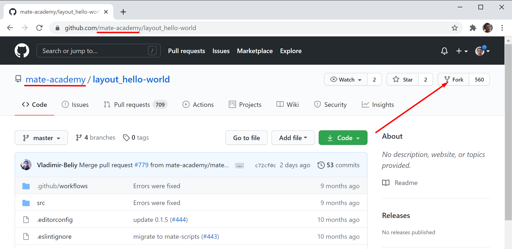
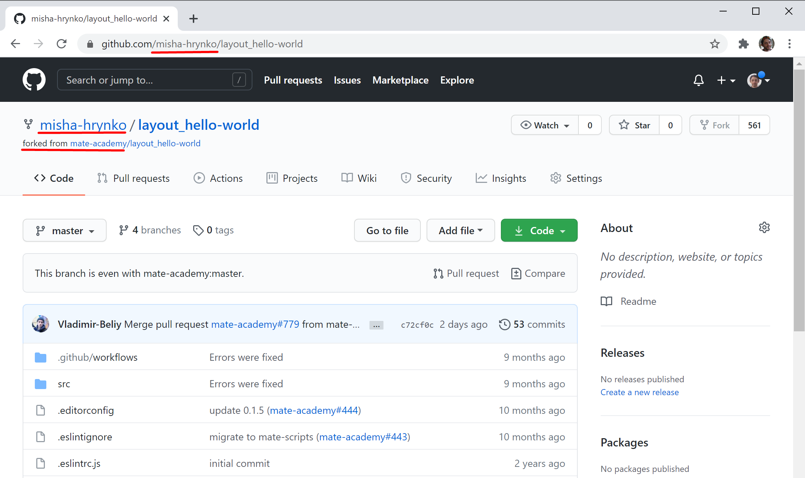
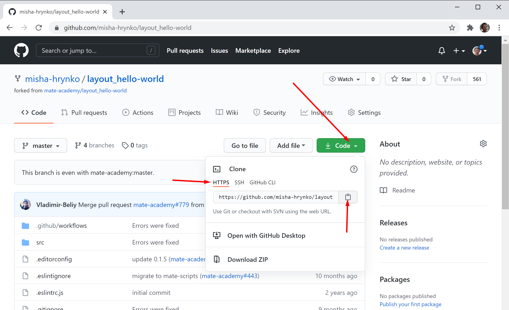
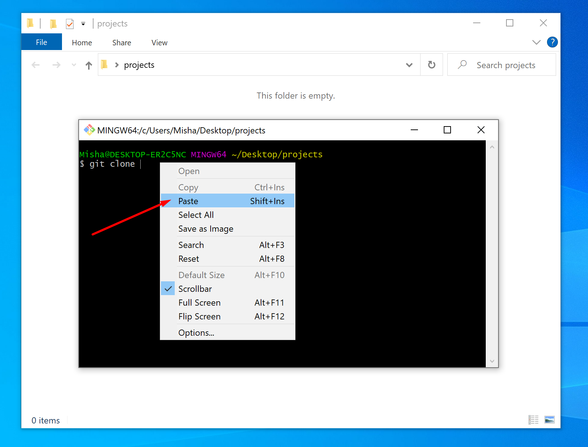
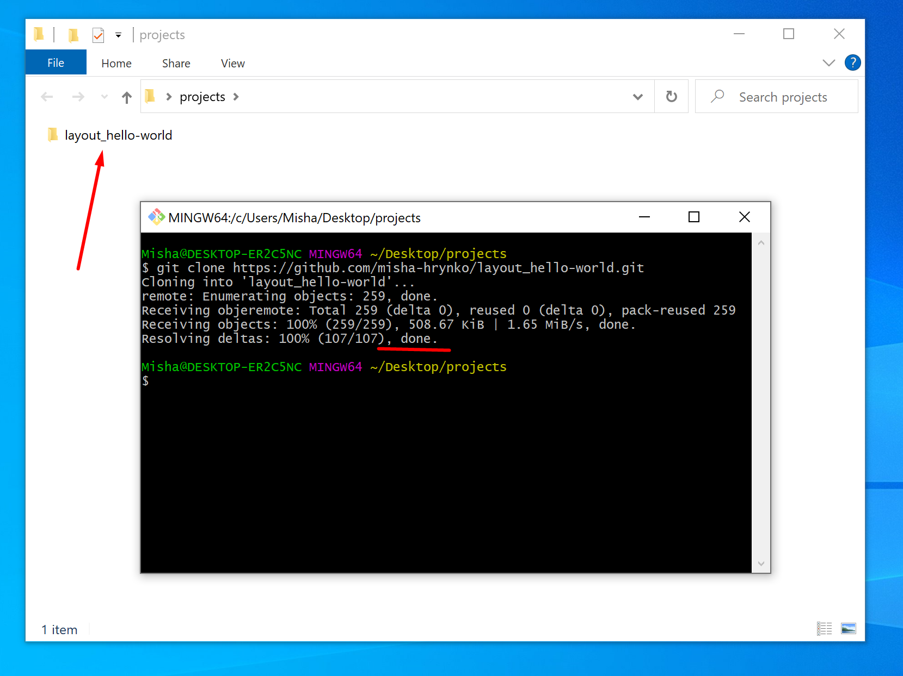
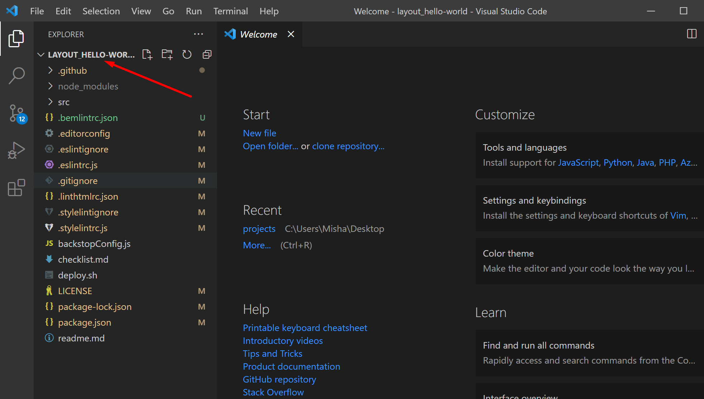
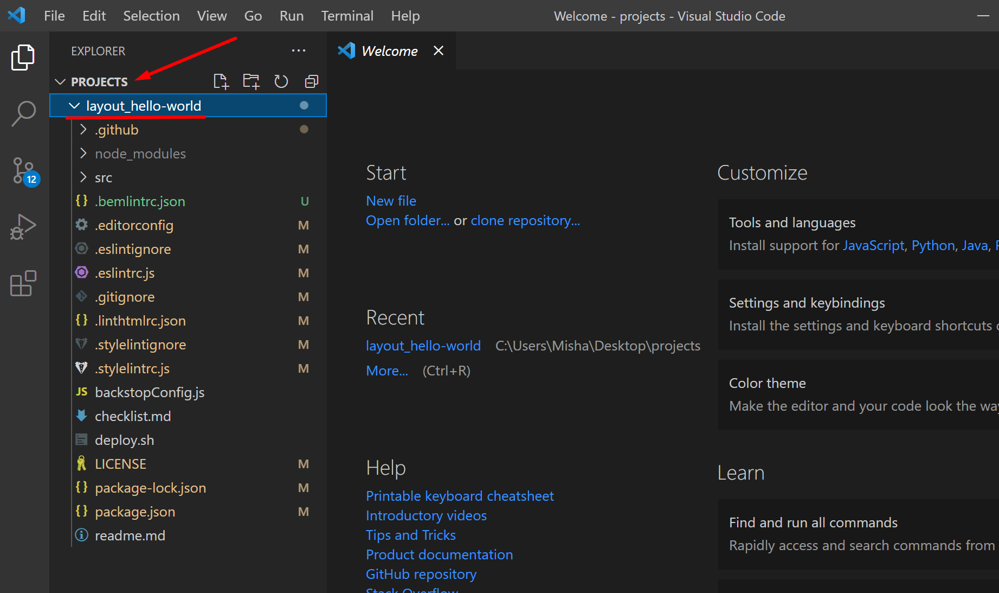

# How to solve the layout tasks on Github

  
<b>If you are not familiar with Git and Github</b>

  - **IMPORTANT** Install Node.js 14 (not 15)
  - Watch the [Git and Github lesson](https://mate.academy/ru/learn/javascript-advanced/git-basics/theory)
  - Finish [githowto](https://githowto.com/)
  - Learn how to use [GitHub Pages](https://pages.github.com/)
  - Read about [Markdown](https://github.com/adam-p/markdown-here/wiki/Markdown-Cheatsheet).
  - Create a repo following [this workflow](./github-workflow.md)

## Follow this steps:
> Learn [Useful GIT and NPM commands](https://mate-academy.github.io/fe-program/css/useful-commands)

1. Open the project on Github and **Fork** the repo.
   

     
Show the screenshot

     
     - Before the fork 
     - After the fork 
   

   
   

     
If you want to delete the repo

   
     - Open project settings 
     - Delete the repo 
   

2. **Clone** the forked repo `git clone the-link-from-github`
   

     
Show the details

     - Open **Git Bash** (Windows) or **Terminal** (macOS) in your projects folder
     - The path to your projects should not contain spaces or non-latin letters
     - run `git clone the-link-from-github`
     - The project link should have your name but not `mate-academy`
       
   

   
   

     
How to open Git Bash

   
     
   

   

     
How to paste the project URL to Terminal (Git Bash)

   
     
   

   

     
Clone success screenshot

   
     
   

3. Open the project in IDE
   - run `code project-folder-name`
   - or just run VSCode and open the project folder
  
   

     
Project is opened correctly

   
     
   

   

     
Project is opened WRONG

   
     
   

4. Open the Terminal in your IDE
   

     
Show the details

   
     - Use the shortcut ``ctrl + ` ``
     - Check if you are inside the project (The project name is the last part in the terminal)
     - Check if you use Git Bash (Windows) of zsh (macOS)
   

   
   

     
How to Select default shell

   
     - Choose `Select default shell` option 
     - Select Git Bash (Windows) or zsh (macOS) 
     - Close all the opened terminals
     - All the new terminals will be Git Bash (or zsh)
   

5. Run `npm install` (or just `npm i`).
   

     
If you don't have Node.js

   
     
   

   
   

     
If you run `npm i` outside the project

   
     
   

   
   

     
If you have Node.js 15 or later

   
     
   

   
   

     
How to reinstall Node.js

   
     - Open `Add and remove programs` 
     - Uninstall Node.js 
     - Download Node.js LTS 
     - Delete `node_modules` 
     - Run `npm i` again 
   

6. Run `npm start` to check if it works.
   

     
Show the details

     - At this point you should see the starting markup of the page at `http://localhost:8080/` opened in your Google Chrome
     - Add some text to `src/index.html`. The change should be immediately updated in the browser.
     - If the page is not updated automatically press `ctrl + r` (`cmd + r` for macOS)
   

   

     
If the page is empty after you added some text

   
     - Update the page by pressing `ctrl + r` (`cmd + r` for macOS)
     - If the page is still empty check if you saved the changes 
     - Enable autosave 
   

   
   

     
If the page is opened at the other port (not :8080)

   
     - If you see the other port 
     - It means you already have another terminal running `npm start` command (maybe it is another project)
     - Stop the `npm start` command in current terminal by pressing `ctrl + c` (all operating systems)
     - Close the other terminal running `npm start`
     - Run the command again for your current project
     - The URL should be now `http://localhost:8080/`
     - If the URL is still wrong, just restart the computer
   

7. Open one more terminal for the next steps.
   

     
Show the screenshot

   
     
   

8. Create the `develop` branch (run `git checkout -b develop`)
   

     
If you see that develop already exists

   
     
     - run `git branch` to see all existent branches 
     - If `develop` is marked with `*` then everything is correct
     - Otherwise, run `git checkout develop` (without `-b` key) 
   

9. Open `readme.md` file and replace a text `<your_account>` with your Github username in the `DEMO LINK` and `TEST REPORT LINK`
   

     
Example

   
     
   

10. Implement the task described in `readme.md`. You should write the code in `index.html` and other files inside `src` folder.
    
11. Run `npm run lint` to check the code style.
    - Fix all the errors and run the command again
12. To check if your solution matches all the expectations you can run `npm test`
    - If you see a failing test you can click on it and see the difference by choosing `REFERENCE` and `TEST` at the top
    - If you see an `ENGINE ERROR: net::ERR_CONNECTION_REFUSED at http://localhost:8080/index.html` it means you don't have a running server
        - Open new terminal and run `npm start`
        - Check if the page is opened at `:8080` port (`http://localhost:8080/`)
        - Run `npm test` again to see the results
    - If test results are not opened in a browser, check if you fixed all the code style errors (`npm run lint`)
    - If you can't run tests for some weird reason just use a page screenshot from
      `backstop_data/bitmaps_reference/Entire_document.png` to ensure your page looks as expected. 
13. Save your changes.
    - If you created new files run `git add path/to/new_file1 path/to/new_file2`.
    - Run `git commit -am "write a short description of the changes you made"` to commit changes.
    - If you see an error `fatal: unable to auto detect email address`, it means you forgot to configure you GIT name and email
        - See the commands above the error message and run them one by one with your email and name
14. Send your code to Github by running `git push origin develop`
    - If you see permissions error (Access denied or refused), often it means you cloned `mate-academy` repo instead of the forked one from your account.
        - Run `git remote show origin` to see the links
        - If links contain with `mate-academy` you should replace them with correct ones
        - Remove remote repo by running `git remote remove origin`
        - Check if it was removed by running `git remote` (there should not be any item in the list)
        - Add a correct server `git remote add origin the-link-to-clone-the-repo`
        - Now it should work
15. Run `npm run deploy` to publish your site to GitHub pages.
    - Open `Setting` tab o your repo on Github and scroll down to `Github pages` section
    - There should be a link to your public page (the same as `DEMO LINK` in your `readme.md`)
    - Wait until it becomes green (may take 1-2 minutes)
    - Open the page and check if you see the updated page
    - If the page is not updated yet, just add `?any-random-text` after the URL
      and press `Enter` to reload the page discarding cached data (if any)
16. Create a Pull Request (PR) from your branch `develop` to branch `master` of original repo.
17. Copy `DEMO LINK` and `TEST REPORT LINK` from `readme.md` to the PR description.
18. Check your work using checklist (look for it in the root directory of the project) before submitting it for review.
19. To update you PR repeat steps 10-15 (no need to create the PR one more time).

> If you need an ADDITIONAL CODE REVIEW, click on re-request button at the PR page.

## Linux users
> If you use _linux_ please make sure you adjusted writing permissions to let 
scripts work without `sudo`. Correct permissions mean you don't see errors like
`permission denied` after running commands in terminal.

## NPM commands
- `npm install` installs the project dependencies and runs `postinstall`
  - which create reference files for pixel perfect and tests 
- `npm start` runs the server required for development and tests
- `npm test` runs linter and tests
  - `npm run lint` runs linter (code style check)
  - `npm run test:only` runs pixel perfect tests
- `npm run deploy` publishes the page and test report to `gh-pages` 

## Useful links
- [NPM and GIT commands](https://mate-academy.github.io/fe-program/css/useful-commands)
- [HTML, CSS styleguide](https://mate-academy.github.io/style-guides/htmlcss.html)
- [Working with figma](./figma.md)
- [Creating a pull request from a fork](https://help.github.com/en/articles/creating-a-pull-request-from-a-fork)
- [How to use pixel perfect extension](https://youtu.be/zqRko57AurU)
